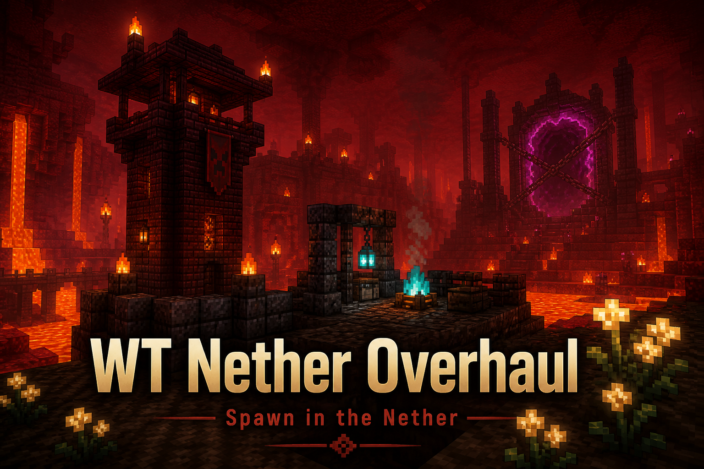

# WT Nether Overhaul



A NeoForge 1.21.1 replacement for the 1.12.2 **Nether Overload** mod. Built for the Dimension Survival remake: you wake in the Nether, the Overworld stays sealed until you find a Rift Key, and the Nether itself is taller, carved with ravines, and dotted with towers, hamlets and wither-ruin pits.

**Download:** [GitHub Releases](https://github.com/whotevatech/nether-overhaul/releases/latest) · Minecraft **1.21.1** · NeoForge **21.1.244+**

Use a **new world** after updating. Worldgen, camp layout and structure grids do not retrofit existing chunks.

## Requirements

- Minecraft 1.21.1
- Java 21
- NeoForge 21.1.244 or newer

## What it does

- **Nether spawn camp.** First join builds a blackstone shelter with crafting table, furnace, water cauldrons, charged respawn anchor, lodestone (signed), wart patch, starter chest (tools, wool, flint, gravel, string), lore book, camp compass, Sealed Flask and 60s fire resistance.
- **Overworld lock.** Portals stay sealed until you use a Rift Key. Creative and operators bypass this by default. Locked portal spam is throttled.
- **Keep-inventory until unlock.** Deaths before the rift opens keep items and XP (config).
- **256-block Nether.** Floor, roof, pillars, lava sea and ravines. Vanilla nether biomes plus Ashen Swamp, Wither Ruins, Quartz Peaks, Ember Fields and Weeping Hollow. Water can be placed (this dimension is not ultra-warm) so cobble and potions are possible.
- **Structures.** Watchtowers, hamlets, wither-ruin pits, ghast nests, basalt forges, quartz shrines, obsidian wells, nether dungeons, fire rings, original-style blaze towers and fire towers. Fortresses and bastions can also generate in the new biomes.
- **Original Nether Overload extras.** Glowstone berries grow on soul sand. Quick soul sand looks like soul sand but traps you like cobweb. Fire-immune nether creepers, spiders and zombies spawn in the wastes. Wither trees and glowstone trees decorate ruins and quartz peaks.
- **Tools.** Rift Seeker (nearest structure), Recall Charm (return to camp), Sealed Flask (fill cauldrons / place water).
- **Pack ores.** Iron, copper, coal and redstone generate in netherrack. `#netheroverhaul:extra_nether_ores` optionally includes Mekanism, AE2, Immersive Engineering, Create, Thermal, Modern Industrialization, Mystical Agriculture, Occultism, Powah and others. Missing mods are skipped. Gravel smelts to sand; four soul soil crafts clay.
- **Vanilla injects.** Fortress / bastion chests and piglin barters can roll this mod's items.
- **Quest hook.** Dummy scoreboard `netheroverhaul_rift` is 1 after unlock (FTB Quests / KubeJS).

## Commands

```
/netheroverhaul where
/netheroverhaul unlock [player]
/netheroverhaul lock [player]
/netheroverhaul spawn
/netheroverhaul locate [tower|hamlet|pit|nest|forge|shrine|well|dungeon|ring|blaze|firetower]
/netheroverhaul key
/netheroverhaul kit
```

`where` is usable by anyone. The rest require permission level 2.

## Config

Server config `netheroverhaul-server.toml` covers spawn, lock, keep-inventory, camp gifts, recall cooldown, structure spacing and extra-ore attempts.

## Backup recipe

A Rift Key can also be crafted from a nether star, ghast tear, two eyes of ender and a blaze rod. Disable it with `allowRiftKeyCrafting`.

## Build

```bat
gradlew.bat build
```

The jar lands in `build/libs/netheroverhaul-neoforge-1.21.1-1.3.3.jar`.

## Licence

MIT — see [LICENSE](LICENSE).

Nether Overload was created by **MCJediYoda**. This is a from-scratch NeoForge remake, not a continuation of that CurseForge project.
